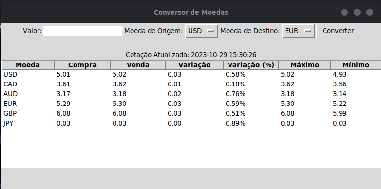

# Conversor de Moedas

Um conversor de moedas que permite converter entre as seguintes moedas: 

-Dólar Americano (USD)
-Dólar Australiano (AUD)
-Dólar Canadense (CAD)
-Euro (EUR)
-Libra Esterlina (GBP)
-Iene Japonês (JPY)

O aplicativo também exibe uma tabela com as últimas cotações de câmbio, incluindo valores de compra, venda, variação, porcentagem de variação, máximo e mínimo para cada moeda.

## Funcionalidades

- Conversão entre as moedas listadas.
- Atualização automática das taxas de câmbio a cada 15 segundos.
- Tabela de cotações atualizada em tempo real.

## Pré-requisitos

- Python 3.x instalado
- Bibliotecas utilizadas no aplicativo (veja em [Requirements.txt](Requirements.txt))

## Como Usar

1. Clone o repositório para o seu computador.

2. Instale as bibliotecas necessárias: `pip install -r requirements.txt`

3. Execute o aplicativo: [Conversor.py](Conversor.py)

4. Escolha a moeda de origem, a moeda de destino e insira o valor a ser convertido.

5. Clique no botão "Converter" para obter o valor convertido.

## Aviso

A moeda Real (BRL) ainda não está disponível no programa. Aguarde as próximas atualizações.

## Autores

- [Deborah Goulart](https://github.com/DebGoulart) - Desenvolvedora

## Licença

Este projeto está licenciado sob a Licença MIT - consulte o arquivo [LICENSE](LICENSE) para obter detalhes.

